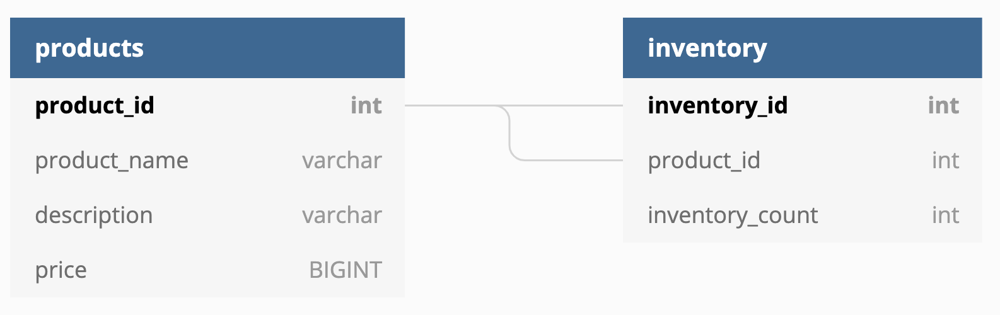
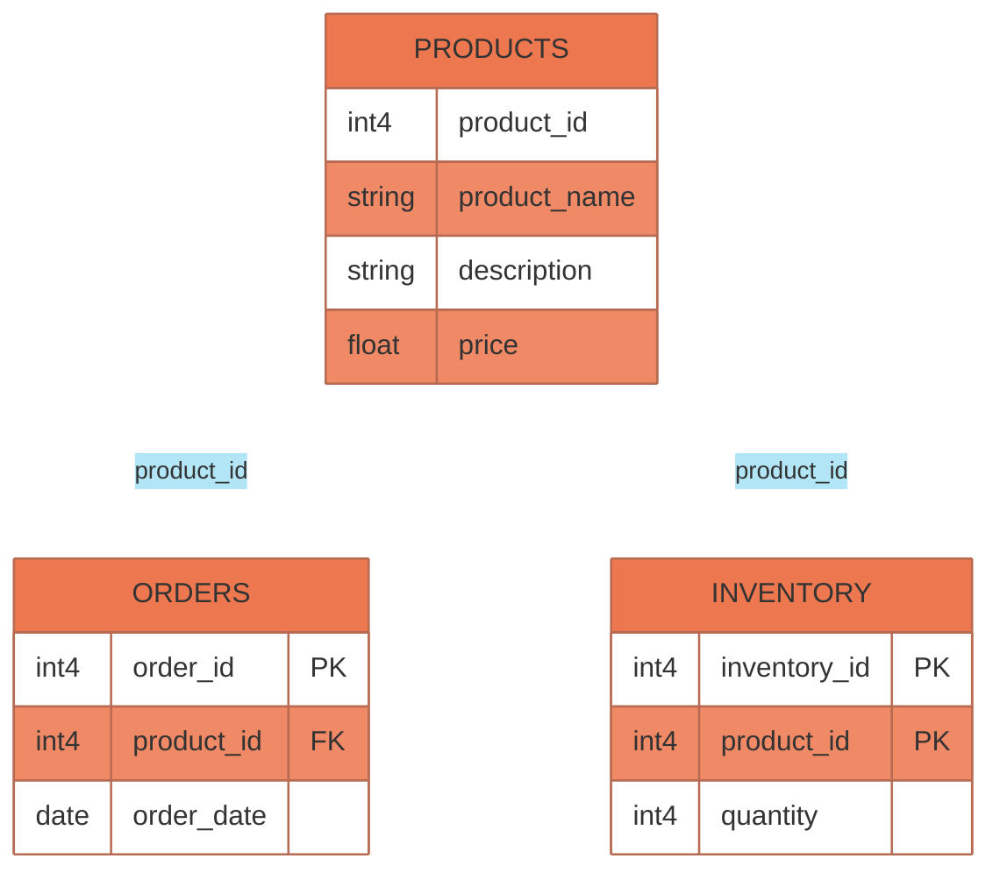

# R2DBC Client for YugabyteDB SQL (YSQL)

This app is a fully reactive Spring Boot implementation backed by YugabyteDB SQL API  (YSQL). [R2DBC](https://r2dbc.io) provides support for reactive streams, a non-blocking way of accessing data from relational databases, alternative to using blocking JDBC drivers. [R2DBC Specification](https://r2dbc.io/spec/0.9.1.RELEASE/spec/html/#introduction) provides a list of top level APIs for driver vendors to implement, we are using R2DBC driver implementation of PostgreSQL for accessing relational data from YugabyteDB.

YugabyteDB YSQL API provides PostgreSQL compatible Distributed SQL API for microservices applications. Read more about YugabyteDB Query Layer [here](https://docs.yugabyte.com/latest/architecture/layered-architecture/)

`r2dbc-ycql-client` app uses the following components:

- Spring WebFlux
- Spring Data R2DBC
- PostgreSQL R2DBC Driver
- Three Node YugabyteDB cluster (v2.15)

App is a REST based application which exposes Reactive APIs for CRUD operations on Products and Inventory table . The sample application will be implementing below table schema.





# Environment Setup


## Step 1: Start the YugabyteDB cluster

You can do so using following command from YugabyteDB installation directory,

```bash
$ yb-ctl destroy && yb-ctl --rf 3 create --tserver_flags="cql_nodelist_refresh_interval_secs=10" --master_flags="tserver_unresponsive_timeout_ms=10000"
```

This will start a 3-node local cluster with replication factor (RF) 3. The flag cql_nodelist_refresh_interval_secs configures how often the drivers will get notified of cluster topology changes and the following flag tserver_unresponsive_timeout_ms is for the master to mark a node as dead after it stops responding (heartbeats) for 10 seconds.

Note: (Detailed installation instructions)[https://docs.yugabyte.com/latest/quick-start/install/#macos] for YugabyteDB on local workstation.

## Step 2: Initialize YugabyteDB

you can do so by executing the following command:

```bash
$ ysqlsh -f src/main/resources/sql/products.sql
$ ysqlsh -f src/main/resources/sql/inventory.sql
$ ysqlsh -f src/main/resources/sql/orders.sql
```

Note: You can find the schema file in following [project directory](src/main/resources/sql)

# Build and Run the application

## Step 1: Build the spring boot application

To build the app, execute the following maven command from the project base directory:

```bash
$ ./mvnw clean package -DskipTests
```

## Step 2: Start the application

you can do so by running the following command:

```bash
$ java -jar target/r2dbc-ysql-client-1.0.0.jar
```

# Working with REST endpoints

## Create a product

You can create a product listing as follows:
```bash
$ curl \
  --data '{ "productName": "Notebook", "description": "200 page notebook", "price": 7.50 }' \
  -v -X POST -H 'Content-Type:application/json' http://localhost:8081/products/add
```

You should see the following return value:
```json
{
  "productId": "1",
  "productName": "Notebook",
  "description": "200 page, hardbound, blank notebook",
  "price": 7.5
}
```
You can connect to YugaByte DB using `ysqlsh` and select these records:

```bash
ysqlsh -c 'select * from products;'
```

You should see output like following:

```log
 product_id | product_name |    description    | price
------------+--------------+-------------------+-------
          1 | Notebook     | 200 page notebook |     8
(1 row)
```

## Retrieve the product using ID

You can retrieve a product using ID as follows:

```bash
$ curl http://localhost:8081/products/1
```

You should see the following return value:
```json
{
  "productId": "1",
  "productName": "Notebook",
  "description": "200 page, hardbound, blank notebook",
  "price": 7.5
}
```

## Add inventory details for a product

You can insert inventory details as follows:

```bash
$ curl \
  --data '{ "productId": 1, "inventoryCount": 100 }' \
  -v -X POST -H 'Content-Type:application/json' http://localhost:8081/inventory/add
```

You should see an output like:

```json
{
  "id":1,
  "productId":1,
  "inventoryCount":100
}
```
You can connect to YugaByte DB using `ysqlsh` and select these records:

```bash
$ ysqlsh -c 'select * from inventory;'
```

You should see output like following:

```log
 inventory_id | product_id | inventory_count
--------------+------------+-----------------
            1 |          1 |
(1 row)
```

## Retrieve the inventory using ID

You can retrieve a product using ID as follows:

```bash
$ curl http://localhost:8081/inventory/1
```

You should see the following:

```json
{
  "id":1,
  "productId":1,
  "inventoryCount":100
}
```

## SQL Join: Retrieve product information along with inventory details

now, you can join the two tables and retrieve the product information with inventory details

```bash
$ 0
```

You should see the following:

```json
{
    "product_id":1,
    "product_name":"Notebook",
    "description":"200 page notebook",
    "price":8,
    "inventory_id":1,
    "inventory_count":100
}
```

## Add order details for a product

You can insert inventory details as follows:

```bash
$ curl \
  --data '{ "productId": 1, "quantity": 10, "date": "2022-01-01" }' \
  -v -X POST -H 'Content-Type:application/json' http://localhost:8081/orders/add

$ curl \
  --data '{ "productId": 1, "quantity": 10, "date": "2022-01-02" }' \
  -v -X POST -H 'Content-Type:application/json' http://localhost:8081/orders/add

$ curl \
  --data '{ "productId": 1, "quantity": 10, "date": "2022-01-03" }' \
  -v -X POST -H 'Content-Type:application/json' http://localhost:8081/orders/add

$ curl \
  --data '{ "productId": 1, "quantity": 10, "date": "2022-01-04" }' \
  -v -X POST -H 'Content-Type:application/json' http://localhost:8081/orders/add
```

You should see outputs as:

```log
{"id":1,"productId":1,"quantity":10,"date":1640995200000}
{"id":101,"productId":1,"quantity":10,"date":1641081600000}
{"id":201,"productId":1,"quantity":10,"date":1641168000000}
{"id":301,"productId":1,"quantity":10,"date":1641254400000}
```
You can connect to YugaByte DB using `ysqlsh` and select these records:

```bash
$ ysqlsh -c 'select * from orders;'
```

You should see output like following:

```log
 order_id | product_id | quantity | order_date
----------+------------+----------+------------
      301 |          1 |       10 | 2022-01-04
      201 |          1 |       10 | 2022-01-03
      101 |          1 |       10 | 2022-01-02
        1 |          1 |       10 | 2022-01-01
(4 rows)

```


## Retrieve the order using ID

You can retrieve a product using ID as follows:

```bash
$ curl http://localhost:8081/orders/get/1
```

You should see the following:

```json
{
  "id":1,
  "productId":1,
  "quantity":10,
  "date":"2022-01-01"
}
```

## SQL Join (One to Many): Retrieve product information along with orders

Now, we will join the two tables (products and orders), but with reactive programming

```bash
$ curl http://localhost:8081/products/with-orders/1
```
You should see the following:

```json


{
  "product": {
    "productId": 1,
    "productName": "Notebook",
    "description": "200 page notebook",
    "price": 8.0
  },
  "orders": [
    {
      "id": 301,
      "productId": 1,
      "quantity": 10,
      "date": "2022-01-04"
    },
    {
      "id": 201,
      "productId": 1,
      "quantity": 10,
      "date": "2022-01-03"
    },
    {
      "id": 101,
      "productId": 1,
      "quantity": 10,
      "date": "2022-01-02"
    },
    {
      "id": 1,
      "productId": 1,
      "quantity": 10,
      "date": "2022-01-01"
    }
  ]
}

```
## Delete the product using ID

You can delete a product using ID as follows:

```bash
$ curl http://localhost:8081/products/delete/1
```
You should see the following:
```
{
  "productId": "1",
  "productName": "Notebook",
  "description": "200 page, hardbound, blank notebook",
  "price": 7.5}
```
